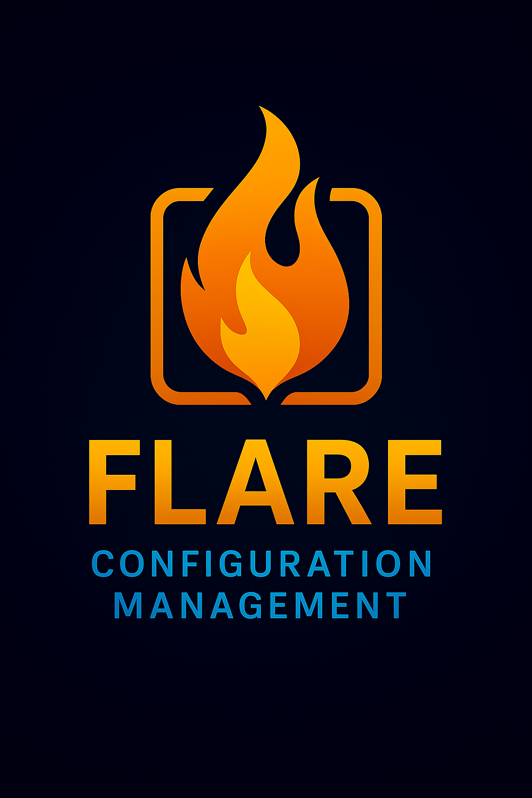

<div align="center">

# 🔥 Flare



[](https://ziglang.org/)
[](https://ziglang.org/download/)
[](https://github.com/ghostkellz/flash)

[](https://github.com/ghostkellz/flare)
[](https://github.com/ghostkellz/flare/releases)
[](LICENSE)

**What Viper is to Cobra in Go, Flare is to Flash in Zig**

*A powerful configuration management library for Zig that provides hierarchical configuration loading, type-safe access, array support, schema validation, CLI integration, and seamless Flash framework compatibility.*

</div>

## Features

- 🏗️ **Arena-based memory management** - Efficient allocation and cleanup
- 📁 **Multiple configuration sources** - JSON/TOML files, environment variables, CLI args
- 🎯 **Type-safe getters** - `getBool()`, `getInt()`, `getFloat()`, `getString()`, `getArray()`, `getMap()`
- 🔄 **Smart type coercion** - Automatic conversion between compatible types
- 🗂️ **Dotted key notation** - Access nested values with `db.host`, `server.port`
- 📊 **Array & object support** - Native handling of lists and nested structures
- ⚡ **Zero-copy string handling** - Memory-efficient string operations
- ✅ **Schema validation** - Declarative configuration structure with constraints
- 📋 **TOML support** - Full TOML parser with automatic format detection
- 🌍 **Environment variable mapping** - `APP_DB__HOST` → `db.host`
- 💻 **CLI arguments parsing** - `--database-host=prod.com` with precedence control
- ⚡ **Flash CLI integration** - Seamless integration with Flash framework
- 🔍 **Detailed error reporting** - Field path and constraint violation messages

## Quick Start

### Installation

Add Flare to your `build.zig.zon`:

```bash
zig fetch --save https://github.com/ghostkellz/flare/archive/refs/heads/main.tar.gz
```

For full Flash CLI integration, also add Flash:

```bash
zig fetch --save https://github.com/ghostkellz/flash/archive/refs/heads/main.tar.gz
```

### Basic Usage

```zig
const std = @import("std");
const flare = @import("flare");

pub fn main() !void {
    var gpa = std.heap.GeneralPurposeAllocator(.{}){};
    defer _ = gpa.deinit();
    const allocator = gpa.allocator();

    // Load configuration from multiple sources with full precedence
    const args = try std.process.argsAlloc(allocator);
    defer std.process.argsFree(allocator, args);

    var config = try flare.load(allocator, .{
        .files = &[_]flare.FileSource{
            .{ .path = "config.toml", .format = .toml },
            .{ .path = "config.json", .format = .json },
        },
        .env = .{ .prefix = "APP", .separator = "__" },
        .cli = .{ .args = args },
    });
    defer config.deinit();

    // Access configuration values with defaults
    const db_host = try config.getString("database.host", "localhost");
    const db_port = try config.getInt("database.port", 5432);
    const debug = try config.getBool("debug", false);

    // Access arrays and nested objects
    const servers = try config.getArray("servers");
    std.debug.print("Found {d} servers\\n", .{servers.items.len});

    std.debug.print("Connecting to {s}:{d} (debug: {})\\n", .{ db_host, db_port, debug });
}
```

### Example Configuration File

**config.toml:**
```toml
debug = false

[database]
host = "localhost"
port = 5432
ssl = true

[server]
host = "0.0.0.0"
port = 8080

# Arrays are fully supported
[[servers]]
name = "api-1"
url = "https://api1.example.com"

[[servers]]
name = "api-2"
url = "https://api2.example.com"
```

**Or config.json:**
```json
{
  "database": {
    "host": "localhost",
    "port": 5432,
    "ssl": true
  },
  "server": {
    "host": "0.0.0.0",
    "port": 8080
  },
  "servers": [
    {
      "name": "api-1",
      "url": "https://api1.example.com"
    },
    {
      "name": "api-2",
      "url": "https://api2.example.com"
    }
  ],
  "debug": false
}
```

### Environment Variables & CLI Arguments

Set environment variables with your configured prefix:

```bash
export APP__DATABASE__HOST=production-db.example.com
export APP__DATABASE__PORT=5432
export APP__DEBUG=true
```

Or override with CLI arguments (highest precedence):

```bash
# Simple flags
./myapp --database-host=prod.example.com --database-port=3306 --debug

# JSON arrays via CLI
./myapp --servers='[{"name":"api-1","url":"https://api1.com"}]'

# Complex nested objects
./myapp --database='{"host":"prod.db.com","port":3306,"ssl":true}'
```

## Schema Validation

Define and validate your configuration structure:

```zig
// Define schema
const MySchema = try flare.Schema.root(allocator, .{
    .database = try flare.Schema.object(allocator, .{
        .host = flare.Schema.string(.{}).required(),
        .port = flare.Schema.int(.{ .min = 1, .max = 65535 }),
    }),
    .debug = flare.Schema.boolean().default(flare.Value{ .bool_value = false }),
});

// Create schema-aware config
var config = try flare.Config.initWithSchema(allocator, &MySchema);
defer config.deinit();

// Load and validate
try loadConfigFromSources(&config);
var validation = try config.validateSchema();
defer validation.deinit(allocator);

if (validation.hasErrors()) {
    for (validation.errors.items) |error_item| {
        std.debug.print("❌ {s}\n", .{error_item.message});
    }
}
```

## Configuration Precedence

Flare follows a clear precedence order (highest to lowest):

1. **CLI Arguments** (highest) - *via Flash CLI integration*
2. **Environment variables**
3. **Configuration files**
4. **Default values** (lowest)

Later sources override earlier ones for the same key.

## Flash CLI Integration

Flare seamlessly integrates with the Flash CLI framework, providing automatic configuration loading with CLI flag mapping:

```zig
const std = @import("std");
const flash = @import("flash");
const flare = @import("flare");

pub fn main() !void {
    var gpa = std.heap.GeneralPurposeAllocator(.{}){};
    defer _ = gpa.deinit();
    const allocator = gpa.allocator();

    // Create Flash command with automatic Flare integration
    const db_command = flare.flash.createConfigCommand(
        "connect",
        "Connect to database",
        .{
            .config_files = &[_]flare.FileSource{
                .{ .path = "config.toml", .required = false },
            },
            .env_source = .{ .prefix = "MYAPP", .separator = "_" },
        },
        &[_]flare.flash.FlagLink{
            .{ .flag_name = "host", .config_key = "database.host", .short = "h" },
            .{ .flag_name = "port", .config_key = "database.port", .short = "p" },
        },
        connectHandler,
    );

    // Configuration is automatically loaded and validated!
}

fn connectHandler(ctx: flare.flash.CommandContext) !void {
    const host = try ctx.config.getString("database.host", "localhost");
    const port = try ctx.config.getInt("database.port", 5432);

    std.debug.print("Connecting to {s}:{d}\\n", .{ host, port });
}
```

### Array & Complex Data Support

Work with arrays and nested objects naturally:

```zig
// Access server arrays from configuration
const servers = try config.getArray("servers");
for (servers.items, 0..) |server, i| {
    if (server.map_value.get("name")) |name| {
        std.debug.print("Server {d}: {s}\\n", .{ i, name.string_value });
    }
}

// Get list of strings from array
const server_names = try config.getStringList("servers[*].name");
for (server_names) |name| {
    std.debug.print("• {s}\\n", .{name});
}

// Access by index
const first_server = try config.getByIndex("servers", 0);
```

## API Reference

### Core Types

- `Config` - Main configuration container
- `Value` - Union type for configuration values
- `LoadOptions` - Options for loading configuration
- `FlareError` - Error types for configuration operations

### Key Methods

- `flare.load()` - Load configuration from multiple sources
- `config.getString()` - Get string value with optional default
- `config.getInt()` - Get integer value with optional default
- `config.getBool()` - Get boolean value with optional default
- `config.getFloat()` - Get float value with optional default
- `config.getArray()` - Get array value for iteration
- `config.getMap()` - Get map/object value
- `config.getStringList()` - Get array as list of strings
- `config.getByIndex()` - Get array element by index
- `config.setDefault()` - Set default values
- `config.validateRequired()` - Validate required keys are present
- `config.validateSchema()` - Validate against defined schema

## Documentation

- [Getting Started Guide](docs/getting-started.md) - Basic setup, CLI integration, and array handling
- [Flash Integration Guide](docs/flash-integration.md) - Complete Flash CLI framework integration
- [Schema System](docs/schema.md) - Declarative configuration validation with array schemas
- [Configuration Sources](docs/sources.md) - JSON, TOML, environment variables, CLI args, and precedence
- [API Reference](docs/api-reference.md) - Complete API documentation with new collection methods
- [Examples](docs/examples.md) - Real-world usage examples with Flash integration and advanced features

## Requirements

- Zig 0.16.0 or later

## License

MIT License - see LICENSE file for details.

## Contributing

Contributions are welcome! Please see CONTRIBUTING.md for guidelines.
