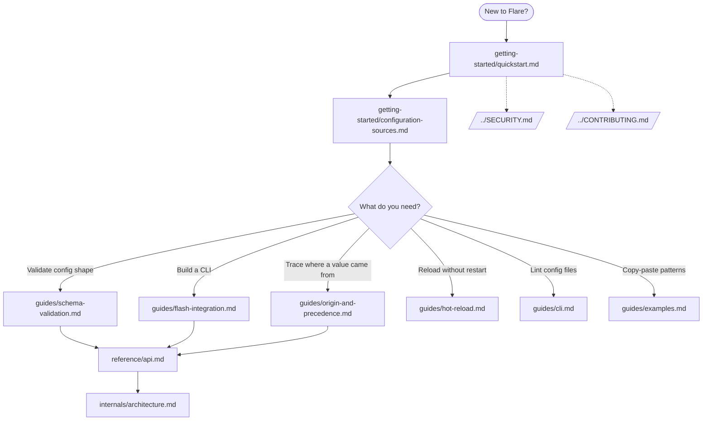
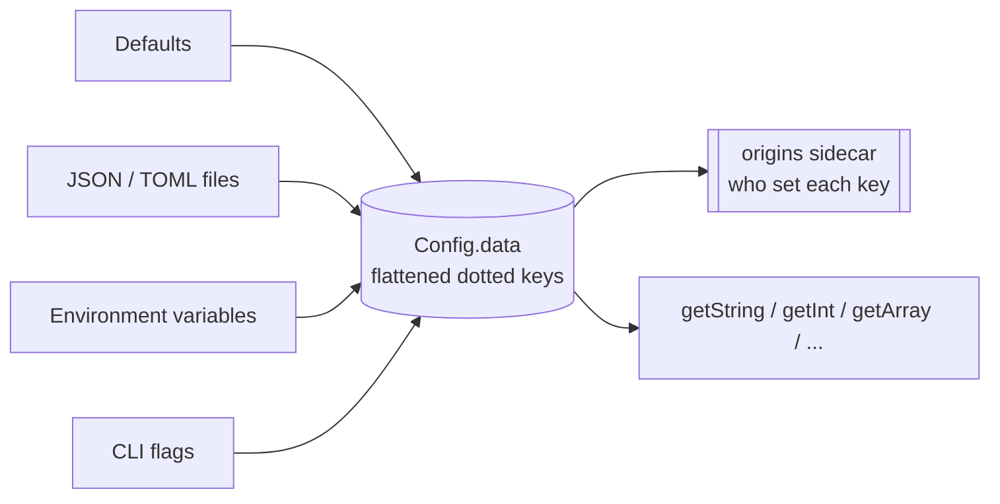

# Flare Documentation

Flare is a hierarchical configuration library for Zig — JSON/TOML files,
environment variables, and CLI flags merged with a clear precedence order,
type-safe access, origin tracking, schema validation, and hot reload. What
Viper is to Cobra in Go, Flare is to Flash in Zig.

This is the documentation index. Every guide is linked below and grouped by
intent: start at **Getting Started**, reach for a **Guide** for a specific
feature, consult the **Reference** for exact signatures, or read **Internals**
to understand how the pieces fit.

## Documentation map

## Runtime shape

How a single `flare.load()` call assembles the final config, lowest precedence
first:

Later layers override earlier ones for the same key. The `origins` sidecar
records which layer won, so `getSource()` / `explain()` can report it.

## Getting Started

- [Quickstart](getting-started/quickstart.md) - install, load config, type-safe access, arrays, and env/CLI overrides.
- [Configuration Sources](getting-started/configuration-sources.md) - JSON, TOML, env vars, CLI args, precedence, and multi-file layouts. Documents intentional non-goals (YAML, JSON comments, duplicate keys).

## Guides

- [Schema Validation](guides/schema-validation.md) - declarative schemas, constraints (`min`/`max`, `min_length`, glob `pattern`, `choices`), array item schemas, and validation errors.
- [Flash CLI Integration](guides/flash-integration.md) - wire Flare into a Flash CLI: flag links, schema-validated commands, multi-command apps.
- [Origin Tracking & Precedence](guides/origin-and-precedence.md) - `getSource()` / `explain()` to trace a value to its layer, plus strict-mode cross-source conflict diagnostics.
- [Hot Reload](guides/hot-reload.md) - watch and reload on change, last-known-good rollback, debounce, and reload diagnostics.
- [CLI: validate & lint](guides/cli.md) - the `flare validate` / `flare lint <file>...` command with per-file TOML/JSON diagnostics and scriptable exit codes.
- [Examples](guides/examples.md) - real-world, copy-pasteable usage.

## Reference

- [API Reference](reference/api.md) - complete types, functions, and methods with signatures and coercion rules.

## Internals

- [Architecture](internals/architecture.md) - the load pipeline, storage model, origin sidecar, and reload state machine, with diagrams of the real code.

## Security & Contributing

- [Security Policy](../SECURITY.md) - supported versions, reporting a vulnerability, hardening expectations.
- [Contributing](../CONTRIBUTING.md) - build, `zig build verify` gate, formatting, and commit conventions.

## Quick reference

| Task | Entry point |
| --- | --- |
| Load config | `flare.load(allocator, options)` |
| Typed access | `config.getString/getInt/getFloat/getBool/getArray/getMap` |
| Where did a value come from? | `config.getSource(key)` / `config.explain(alloc, key)` |
| Validate against a schema | `config.setSchema(&s)` + `config.validateSchema()` |
| Reload on change | `config.enableHotReload(cb)` + `config.checkAndReload()` |
| Lint a file from the shell | `flare validate <file>...` (exit 0 ok / 1 invalid / 2 usage) |
