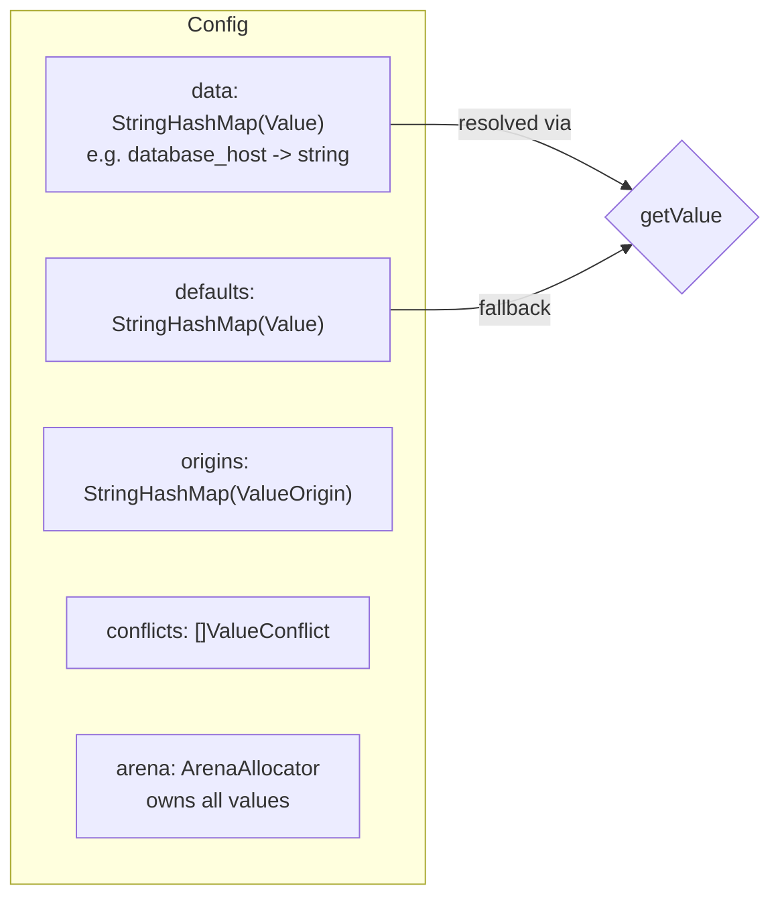
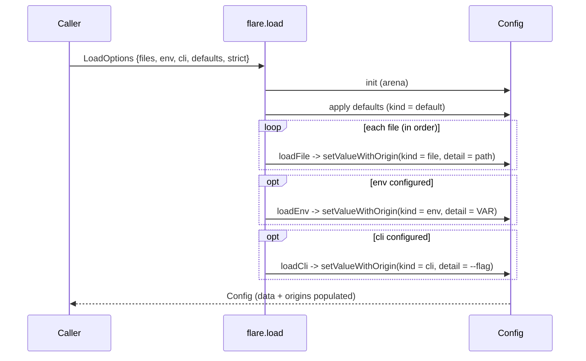
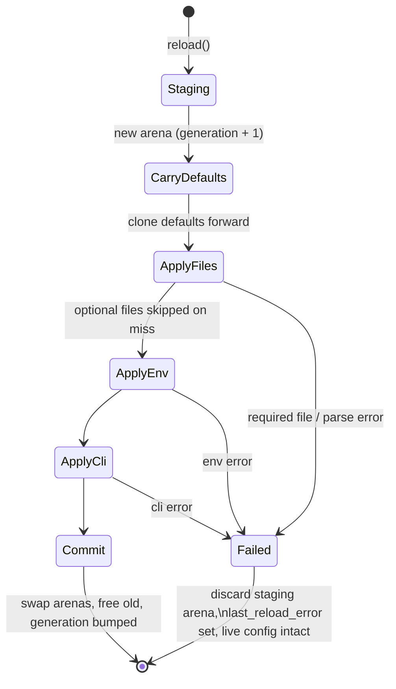

# Architecture

This document describes how Flare is built internally: the load pipeline, the
storage model, origin tracking, and the hot-reload state machine. The diagrams
describe the real code paths in `src/root.zig` and the parser modules, not an
idealized design.

## Module layout

| Module | Responsibility |
| --- | --- |
| `src/root.zig` | Public API: `Config`, `load`, typed getters, origins, hot reload. |
| `src/toml_lexer.zig` | TOML 1.0 tokenizer (escapes, datetimes, numbers). |
| `src/toml_parser.zig` | TOML 1.0 parser producing `TomlValue`/`TomlTable`; error context. |
| `src/toml_value.zig` | Native TOML types (`TomlValue`, `TomlTable`, `TomlArray`, datetimes). |
| `src/schema.zig` | `Schema`, constraints, `globMatch`, validation. |
| `src/schema_gen.zig` | Comptime schema derivation from Zig structs. |
| `src/deserialize.zig` / `src/serialize.zig` | Struct ↔ TOML conversion. |
| `src/stringify.zig` | TOML output with `FormatOptions`. |
| `src/convert.zig` | TOML → JSON. |
| `src/diff.zig` | Table diff/merge. |
| `src/flash_bridge.zig` | Flash CLI flag → config-key wiring. |
| `src/main.zig` | `flare` CLI (`validate`/`lint`) + demo. |

## Storage model

A `Config` stores **flattened dotted keys**, not a nested tree:

- `database.host` is stored under the flattened key `database_host`. Lookups
  translate dots to underscores on a stack buffer (`getValue`,
  `root.zig`), falling back to arena allocation only for keys longer than the
  buffer.
- Reads resolve `data` first, then `defaults` — this is the precedence floor.
- Every value is owned by the `Config`'s arena; `deinit()` frees the whole
  arena in one shot. `setValueWithOrigin` deep-clones incoming values into the
  arena so callers never share ownership.
- Arrays and nested objects also keep a `map_value`/`array_value`
  representation so `getArray`/`getMap` work on loaded config (dual
  representation).

## Load pipeline

`flare.load()` applies sources in ascending precedence, so later writers win:

Precedence, lowest to highest: **defaults → files (in listed order) → env →
CLI**. Each `setValueWithOrigin` overwrites the prior value for a key and
records the new `ValueOrigin`, so the final `origins` entry names the winning
layer.

## Origin tracking

`ValueOrigin { kind, detail, generation }` is an additive sidecar keyed by the
same flattened key as `data`:

- `kind`: `default | file | env | cli | set` (`OriginKind`).
- `detail`: human-facing source — file path, env var name, or `--flag`.
- `generation`: reload counter, `0` on initial load, bumped on each successful
  reload.

`getSource(key)` mirrors the `data`-then-`defaults` precedence used by reads and
returns the winning origin; `explain(alloc, key)` formats it as a line such as
`database.host <- file (config.toml), generation 0`.

### Strict-mode conflicts

When `strict` is enabled (`setStrict(true)` / `LoadOptions.strict`),
`setValueWithOrigin` compares the outgoing and incoming value **types**. A
cross-source type change (e.g. an int in a file overridden by a string from the
environment) is recorded as a `ValueConflict { key, previous_kind,
previous_type, new_kind, new_type }`, surfaced via `hasConflicts()` /
`getConflicts()`. Conflicts are diagnostics — the override still applies.

## Hot-reload state machine

`reload()` never mutates the live config until a full rebuild succeeds. It
stages into an independent arena and swaps atomically:

- **Last-known-good:** on any failure the staging arena is thrown away
  (`errdefer`) and the running config is untouched; `lastReloadError()` exposes
  the failure.
- **Commit:** on success the staged `data`/`defaults`/`origins`/`conflicts` and
  the new arena replace the live ones, and the old arena is freed.
- **Debounce:** `setReloadDebounce(ns)` makes `checkAndReload()` wait for a
  file to be quiescent for `ns` before acting, coalescing rapid writes.
  `checkAndReload()` commits watcher mtimes and fires the change callback only
  after a successful reload.

## Diagnostics

TOML parse errors carry an `ErrorContext` (line, column, source line, message,
suggestion, and a lazily built dotted key path). The `flare validate` /
`flare lint` CLI renders these as `path:line:col: message`. See
[CLI: validate & lint](../guides/cli.md).

## See also

- [API Reference](../reference/api.md)
- [Origin Tracking & Precedence](../guides/origin-and-precedence.md)
- [Hot Reload](../guides/hot-reload.md)
